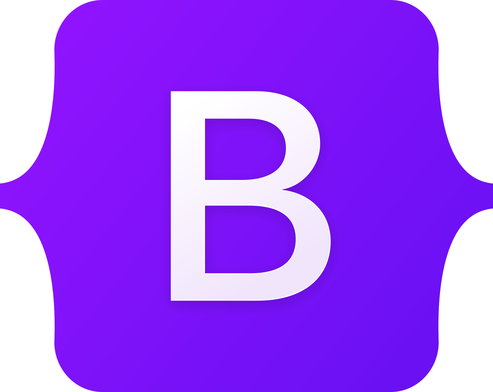
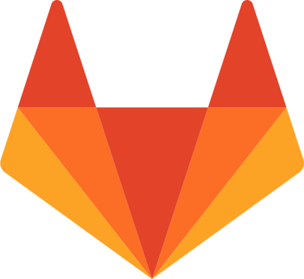

<h1 align="center"> Welcome To My Portafolio! 👋 </h1>

<!-- Portada -->

<!-- Redes de contacto -->

    
    
    

<!-- Description about me -->
<h2 align="center">✨ About Me</h2>

🌱 I enjoy continuously learning new things and improving my skills as a developer.
 
🎓 I studied at the Universidad Católica de Pereira and obtained my degree in Software Development Technology, and two years later, the degree in Systems Engineering and Telecommunications.
 
💼 I have three years of experience in the fintech sector as a full-stack developer.

 

<!-- languajes and skills section -->
<h2 align="center">🚀 Languages/Frameworks I'm good at:</h2>

    <code></code>
    <code></code>
    <code></code>
    <code></code>
    <code></code>
    <code></code>
    <code></code>

 

<h2 align="center">📚 Languages/Frameworks I'm learning:</h2>

    <code></code>
    <code></code>
    <code></code>
    <code></code>

 

<h2 align="center">🌳 Environments I work with:</h2>

    <code></code>
    <code></code>
    <code></code>
    <code></code>

 

<!-- GitHub stats section -->
## 📊 GitHub Stats

   
  
  
   
  

    <b>Note:</b> Top languages is only a metric of the languages my public code consists of and doesn't reflect experience or skill level.
  

 

<!-- Projects section -->
## 📘 My top open source projects

  

    
    
  

  
&#8192;

  

    
    
  

  

 

## ✍️ Random Quote

